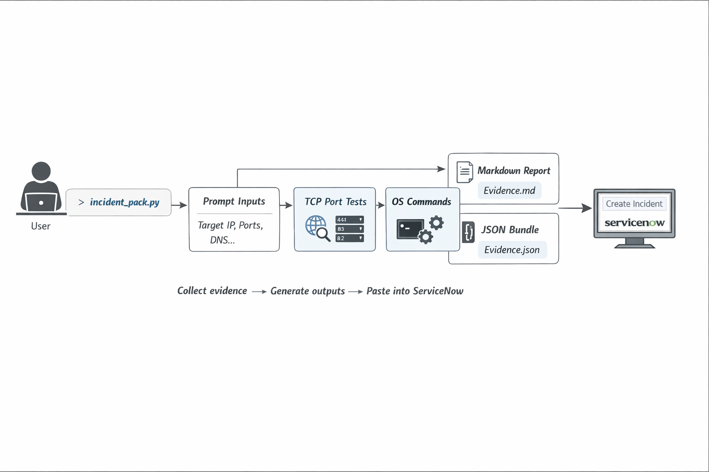

# servicenow-incident-pack

A Python CLI tool that standardizes **host-side incident evidence collection** into:
- **Markdown**: ticket-ready report you can paste into **ServiceNow**
- **JSON**: structured evidence bundle for automation/analysis later

This is a **public-safe portfolio template** (no proprietary endpoints, no ServiceNow API keys, no internal tooling assumptions).

---

## Problem

In enterprise support environments, many tickets are submitted by non-technical users with little to no diagnostic context. The first 30–60 minutes often becomes repetitive back-and-forth (IP/gateway/DNS/reachability/what changed), and shift handoffs re-triage the same basics.

---

## Solution

`incident_pack.py` collects a consistent baseline "evidence pack" so every ticket starts with the same high-signal L1–L4 data, in a format that's easy to hand off and easy to paste into ServiceNow.

---

## Architecture



**Flow:** User runs script → Prompts for context → Collects evidence (DNS, TCP, OS commands) → Generates Markdown + JSON → Paste into ServiceNow

---

## What it collects (Phase 1 — implemented)

High-signal evidence that covers L1–L4 from the host/client perspective:

- **Ping** (ICMP): basic L3 reachability
- **Traceroute / Tracert**: where the path breaks
- **DNS resolution proof**: `socket.getaddrinfo()` to separate name vs path issues
- **TCP port tests**: `socket.create_connection()` to validate L4 reachability (443/80/22/etc.)
- **Local state** (OS-aware best effort):
  - interfaces/IP config
  - routing table
  - ARP/neighbor table
  - socket/connection summary (platform dependent)

**Outputs:**
- `incident_pack_<host>_<timestamp>.md`
- `incident_pack_<host>_<timestamp>.json`

---

## Example outputs (committed)

- **Markdown report** (ServiceNow-ready):
  - [View sample Markdown output](examples/sample_output.md)
  
- **JSON evidence bundle**:
  - [View sample JSON output](examples/sample_output.json)

---

## Usage

### Requirements
- Python 3.10+ (stdlib only; no external dependencies)

### Live run
```bash
python3 incident_pack.py --target 10.20.30.40 --dns-name app.example.com --ports 443 80 22
```

### Mock run (for deterministic GitHub demo output)
```bash
python3 incident_pack.py --target 10.20.30.40 --dns-name app.example.com --ports 443 80 22 --mock --out-dir examples --non-interactive
```

---

## Results & Impact (observed)

- Reduces first-pass triage time by standardizing baseline evidence collection
- Improves shift handoffs (engineers inherit the same evidence structure every time)
- Decreases re-triage (DNS/TCP/path/local state captured up front)

(Portfolio note: metrics are representative of real-world workflows; this repo is a public-safe template.)

---

## Technical Approach

### Cross-Platform Support
Detects OS (Linux/macOS/Windows) and runs appropriate commands:
- Linux: `ip addr`, `ip route`, `ip neigh`
- macOS: `ifconfig`, `netstat -rn`, `arp -an`
- Windows: `ipconfig /all`, `route print`, `arp -a`

### Error Handling
Graceful failure handling - if a command times out or fails, it's captured as evidence rather than crashing the script.

### Evidence Collection Strategy
- These are the exact commands engineers run manually anyway
- Covers the most common failure points (L1-L4)
- High signal-to-noise ratio

### Design Decisions

**Why JSON + Markdown?**
- JSON: Structured data for future automation/tooling
- Markdown: Human-readable, pastes cleanly into ServiceNow

**Why these specific checks?**
- Ping: Basic reachability
- Traceroute: Path isolation
- DNS: Separates name vs network issues
- TCP connect: Layer 4 validation (more useful than ping for app troubleshooting)
- Interface/routing/ARP: Local network state

**Why `--mock` flag?**
- Generates deterministic demo output for GitHub
- Allows portfolio showcase without running live commands

---

## Roadmap (Phase 2 — planned)

Device-side evidence collection via SSH/APIs (template plan):

- **Cisco** (Netmiko): BGP/OSPF neighbors, interfaces, trunks, STP, ARP
- **Palo Alto** (API): traffic logs, session table, routing lookups
- **Meraki/Aruba** (API): client connection state, SSID/VLAN mapping, AP health/uplink

**Optional:**
- ServiceNow API integration (auto-create/update incident)
- Visualization for traceroute (graph/path summary)
- Historical trending to identify systematic issues

---

## Tech Stack

- **Python 3.10+**
- **Standard library only** (subprocess, socket, json, platform)
- **Cross-platform** (Linux, macOS, Windows)

---

## Notes

- Commands are OS-aware (Windows/macOS/Linux) and best-effort; availability varies by environment
- Failures never crash the run; errors become evidence in the outputs
- Generated timestamped packs should be ignored via `.gitignore` (keep only `examples/sample_output.*` committed)

---

Built to eliminate repetitive manual work, standardize operations, and make the team better over time.
