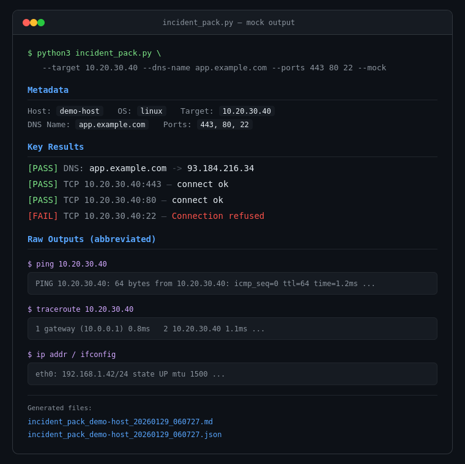
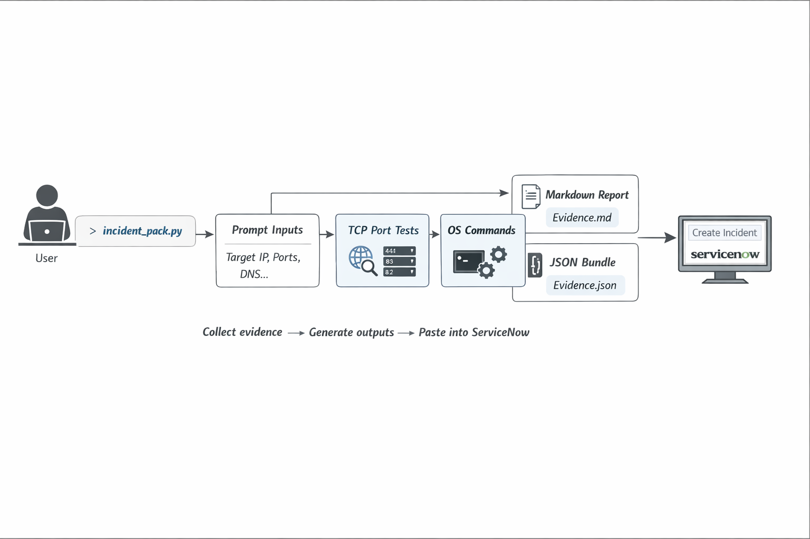

# servicenow-incident-pack

A Python CLI tool that standardizes **host-side incident evidence collection** into:
- **Markdown**: ticket-ready report you can paste into **ServiceNow**
- **JSON**: structured evidence bundle for automation, analysis, or handoff workflows

This is a **public-safe portfolio template**:
- no proprietary endpoints
- no ServiceNow credentials
- no internal tooling assumptions
- deterministic mock output for safe GitHub demos on any host OS

---

## Problem

In enterprise support environments, many tickets are opened with almost no diagnostic context. The first 30–60 minutes often becomes repetitive back-and-forth:
- What is the target?
- Is it DNS or network path?
- Is TCP actually open?
- What changed?
- What did the last shift already test?

That slows triage, weakens handoffs, and wastes senior engineer time.

---

## Solution

`incident_pack.py` creates a consistent baseline evidence pack so every ticket starts with the same high-signal L1–L4 data in a format that is easy to read, easy to paste into ServiceNow, and easy to extend later.


---

## Architecture



**Flow:** User runs script → adds incident context → tool collects host-side evidence → JSON + Markdown are generated → Markdown is pasted into ServiceNow → JSON is retained for later automation/analysis

---

## What it collects

High-signal evidence from the client/host perspective:

- **Ping** for basic L3 reachability
- **Traceroute / Tracert** for path isolation
- **DNS resolution proof** using `socket.getaddrinfo()`
- **TCP port tests** using `socket.create_connection()`
- **Local state** (OS-aware, best effort)
  - interface/IP details
  - routing table
  - ARP/neighbor table
  - socket/connection summary

**Outputs:**
- `incident_pack_<host>_<timestamp>.md`
- `incident_pack_<host>_<timestamp>.json`
- if a timestamp collision occurs, a numeric suffix is added automatically

---

## Usage

### Requirements
- Python 3.10+
- Standard library only at runtime

### Live run
```bash
python3 incident_pack.py --target 10.20.30.40 --dns-name app.example.com --ports 443 80 22
```

### Mock run (safe GitHub demo)
```bash
python3 incident_pack.py --target 10.20.30.40 --dns-name app.example.com --ports 443 80 22 --mock --out-dir examples --non-interactive
```

### Run tests
```bash
python3 -m unittest discover -s tests -v
```

### Optional local quality tooling
The repo also includes `pyproject.toml` settings for Ruff and mypy if you want stricter local checks, but the runtime script itself stays standard-library only.

---

## Example outputs

- [View sample Markdown output](examples/sample_output.md)
- [View sample JSON output](examples/sample_output.json)

These committed samples are generated from `--mock` mode with a fixed demo host/OS profile to avoid leaking real local host details.

---

## Technical Approach

### Cross-platform support
The tool detects the operating system and runs platform-appropriate commands:
- **Linux**: `ip addr`, `ip route`, `ip neigh`, `ss -tulpn`
- **macOS**: `ifconfig`, `netstat -rn`, `arp -an`, `netstat -anv`
- **Windows**: `ipconfig /all`, `route print`, `arp -a`, `netstat -ano`

### Evidence strategy
This repo focuses on the same checks engineers run manually during first-pass troubleshooting:
- name resolution
- path reachability
- port accessibility
- local interface/routing state

### Error handling
Failures do **not** crash the run. Command failures, timeouts, and network exceptions are captured as evidence and written into the output.

### Design choices
**Why Markdown + JSON?**
- **Markdown** pastes cleanly into ticket systems and is readable during handoff
- **JSON** preserves structure for future automation, parsing, or enrichment

**Why `--mock`?**
- makes the repo demoable on GitHub
- creates deterministic, public-safe sample output
- avoids publishing real interface, route, or neighbor data

**Why keep it host-side first?**
- fastest path to value
- no credentials required
- strong baseline before adding network-device evidence in future phases

---

## Validation status

What has been validated in this public repo:
- deterministic mock-mode output
- standard-library runtime execution
- unit tests for failure handling, truncation, input validation, and file-output behavior
- cross-platform CI matrix for compile, test, and mock smoke checks
- local host-side live execution on a non-production machine

What has **not** been validated here:
- active production network devices
- SSH/API collection against Cisco, Palo Alto, Aruba, or similar platforms
- ServiceNow API submission workflows

That distinction matters. This repo is positioned honestly as a strong host-side incident-evidence collector, not a field-proven multi-vendor incident platform.

---

## Results / Portfolio Value

This project demonstrates:
- practical incident-response thinking
- cross-platform Python automation
- structured evidence collection
- operational empathy for shift handoff and triage quality
- a foundation for future ServiceNow or device-side integrations

It is not just “a script that runs commands.” It is a small operational product with a clear workflow and a clear business reason to exist.

---

## Roadmap

### Phase 2
Template plan for device-side evidence collection via SSH / APIs:
- **Cisco / Netmiko**: interface state, trunks, STP, ARP, routing neighbors
- **Palo Alto API**: session, route, and traffic validation
- **Meraki / Aruba APIs**: client state, SSID/VLAN mapping, AP health

### Optional extensions
- ServiceNow API integration
- redaction mode for public sharing
- richer Markdown summary section
- traceroute visualization / path summarization
- historical comparison to spot recurring failure patterns

---

## Repo hygiene notes

- Generated incident packs should stay out of version control
- Only safe sample outputs in `examples/` should be committed
- Mock mode uses a fixed demo host/OS profile so public artifacts stay clean and repeatable

---

## Tech stack

- Python 3.10+
- Standard library only at runtime
- Cross-platform support for Linux, macOS, and Windows
- GitHub Actions for compile, test, and mock smoke validation

---

Built to remove repetitive manual work, improve handoffs, and raise the quality of every incident from the first touch.
